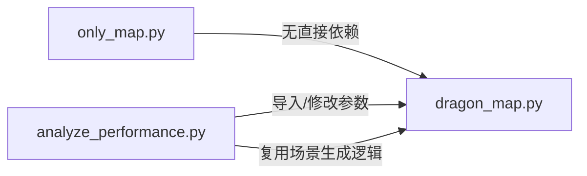

# DiDi-Pro
This is the repository for the major assignment of the specialized course “Fundamentals of Artificial Intelligence”.

## 依赖环境
import pygame
import random
import sys
import numpy as np
from enum import Enum
import heapq
import time
import matplotlib.pyplot as plt


## 主程序名
dragon_map.py

而only_map只生成图analyze_performance只有分析参数影响
## 代码文件结构

# 路径规划与用户-车辆匹配系统
本文档详细说明系统的代码组织结构、核心功能及模块间依赖关系，助力快速理解代码逻辑与使用方式。

## 整体架构
系统由 3 个核心 Python 文件构成，分工明确且层层递进，覆盖**场景可视化**、**核心算法实现**、**参数性能分析**全流程：

| 文件名称                | 核心功能                                                                 | 定位                 |
|-------------------------|--------------------------------------------------------------------------|----------------------|
| `only_map.py`           | 网格地图生成、场景元素（用户/车辆/障碍物）随机放置与静态可视化           | 基础场景展示工具     |
| `dragon_map.py`         | A*/蚁群(ACO)/混合算法实现、用户-车辆匹配逻辑、路径可视化                 | 核心算法模块         |
| `analyze_performance.py`| 多参数遍历测试、算法耗时/路径距离分析、可视化图表生成                   | 性能分析与参数调优   |

## 模块详细说明

### 1. `only_map.py`：基础场景可视化
#### 核心功能
生成网格地图，随机生成并展示用户、车辆、障碍物、目的地的位置（无路径规划逻辑），用于直观呈现算法运行的基础场景。

#### 代码结构
```python
# 配置层
Color: 枚举类，定义元素展示颜色（障碍物/用户/车辆/目的地等）
GRID_ROWS/GRID_COLS: 网格行列数
WINDOW_WIDTH/WINDOW_HEIGHT: 窗口尺寸
COUNT_user/COUNT_car/COUNT_stop: 各类元素数量配置

# 工具函数层
def generate_random_xy(count, max_x, max_y, avoid=None):
    """生成不重复的随机坐标，支持避开指定区域（如障碍物）"""

def draw_grid(screen):
    """绘制网格线，构建地图基础框架"""

def draw_block(screen, x, y, color, label=""):
    """绘制单个网格块，包含颜色填充和标签展示"""

# 主程序层
def main():
    # 1. 初始化Pygame窗口
    # 2. 依次生成障碍物→用户→目的地→车辆的不重叠坐标
    # 3. 调用绘图函数渲染所有元素
    # 4. 保持窗口显示，等待关闭

if __name__ == "__main__":
    main()
```

### 2. `dragon_map.py`：核心算法实现
#### 核心功能
实现 A* 算法、蚁群算法（ACO）及混合算法（A*+ACO），提供用户与车辆的贪心匹配逻辑，支持路径可视化与多算法对比。

#### 代码结构
```python
# 全局配置层
Color: 扩展枚举类，补充路径展示颜色
# 算法参数配置（支持动态调整）
ALPHA/BETA: 蚁群算法启发函数权重
RHO: 信息素挥发系数
ANT_COUNT: 蚁群数量
MAX_ACO_ITERATIONS: 蚁群迭代次数等

# 绘图工具层（复用+扩展）
def generate_random_xy(...):  # 同 only_map.py，适配场景生成
def draw_grid(...):           # 绘制网格
def draw_single_block(...):   # 绘制单个元素（用户/车辆/障碍物）
def draw_path(screen, path, color):
    """绘制路径线条，可视化规划结果"""

# 核心算法类
class HybridPathPlanner:
    def __init__(self, stops):
        """初始化规划器，传入障碍物坐标"""

    # 基础工具方法
    def heuristic(self, a, b):
        """曼哈顿距离启发函数，为A*算法提供估值"""
    def get_neighbors(self, pos):
        """获取网格中某点的合法邻居（非障碍物+在网格内）"""

    # 算法实现
    def a_star_with_pheromone(self, start, end, use_pheromone=True):
        """带信息素的A*算法，可关闭信息素影响"""
    def aco_optimize_path(self, start, end, initial_path):
        """蚁群算法优化路径，基于A*初始路径迭代"""
    def hybrid_find_path(self, start, end):
        """混合算法：短路径用A*，长路径用ACO优化"""
    def pure_a_star(self, start, end):
        """纯A*算法接口"""
    def pure_aco(self, start, end):
        """纯蚁群算法接口"""

    # 匹配逻辑
    def match_users_by_total_distance(self, cars, users, dests):
        """贪心策略：总距离最小化，匹配用户与车辆"""
    def match_users_pure_a_star(self, cars, users, dests):
        """纯A*算法的用户-车辆匹配"""
    def match_users_pure_aco(self, cars, users, dests):
        """纯蚁群算法的用户-车辆匹配"""

# 辅助函数
def print_matching_summary(result):
    """打印匹配结果统计（总距离、成功匹配数等）"""

# 主程序层
def main():
    # 1. 生成场景（障碍物/用户/目的地/车辆）
    # 2. 初始化规划器，分别调用混合/A*/ACO算法
    # 3. 可视化路径与匹配结果
    # 4. 打印多算法对比数据

if __name__ == "__main__":
    main()
```

### 3. `analyze_performance.py`：性能分析与参数调优
#### 核心功能
遍历测试不同算法参数对性能的影响，生成“参数-耗时-路径距离”双轴图表，辅助参数优化。

#### 代码结构
```python
# 测试配置层
test_configs = {
    # 规模参数：蚁群数量、迭代次数
    'ANT_COUNT': np.linspace(5, 150, 15, dtype=int).tolist(),
    'MAX_ACO_ITERATIONS': np.linspace(5, 100, 15, dtype=int).tolist(),
    # 权重参数：ALPHA/BETA/RHO
    'ALPHA': np.linspace(0.1, 10, 20).tolist(),
    'BETA': np.linspace(0.1, 10, 20).tolist(),
    'RHO': np.linspace(0.01, 0.99, 20).tolist(),
    # 增量/初始参数：Q（信息素增量）、INITIAL_PHEROMONE
    'Q': [10, 20, 50, ...],
    'INITIAL_PHEROMONE': np.linspace(0.1, 10, 15).tolist()
}
TRIALS_PER_VALUE = 5  # 每个参数值的测试次数

# 测试执行层
def run_single_test(param_name, value, planner, cars, users, dests):
    """单次测试指定参数值：修改参数→执行匹配→返回耗时+总距离"""
    # 1. 保存原始参数值
    # 2. 修改 dragon_map 中的目标参数
    # 3. 执行匹配算法，记录耗时和总距离
    # 4. 恢复原始参数值

# 主分析层
def main_analysis():
    # 1. 生成固定测试场景（避免场景随机性影响结果）
    # 2. 初始化混合规划器
    # 3. 遍历每个参数的所有取值：
    #    - 调用 run_single_test 收集耗时/距离数据
    #    - 绘制双轴图表（横轴：参数值；左轴：耗时；右轴：总距离）
    #    - 保存图表为 analysis_{param}.png
    # 4. 输出分析日志

if __name__ == "__main__":
    main_analysis()
```

## 模块间依赖关系

- `only_map.py`：独立模块，仅用于场景可视化，无外部依赖；
- `dragon_map.py`：核心模块，被 `analyze_performance.py` 导入，提供算法和场景生成能力；
- `analyze_performance.py`：依赖 `dragon_map.py` 的 `HybridPathPlanner` 类和全局参数，实现性能测试。

## 核心逻辑流程
```
场景生成（随机坐标）→ 路径规划（A*/ACO/混合算法）→ 用户-车辆匹配（贪心策略）→ 结果可视化 → 多参数性能分析
```