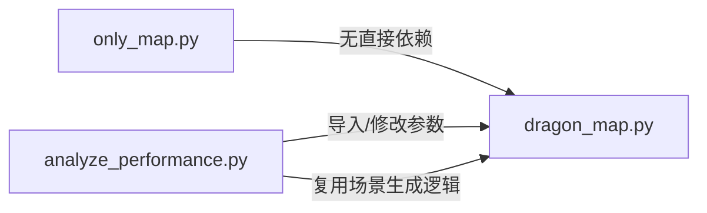

# DiDi-Pro
This is the repository for the major assignment of the specialized course “Fundamentals of Artificial Intelligence”.

## 依赖环境(见Dockerfile和docker-compose.yaml)
本项目的环境配置采用docker容器，因此需要装载docker，或者直接安装相关依赖。下面介绍如何基于docker，配置本项目的容器环境。

### 使用流程
```bash
首先在github上面拉取本项目仓库
$ git clone https://github.com/Yc-Dlan/DiDi-Pro.git
$ git clone git@github.com:Yc-Dlan/DiDi-Pro.git
(如果配置了ssh密钥，则选择下面这个)

$ cd DiDi-pro/.devcontainer

$ docker compose build

$ docker compose up -d

$ docker exec -it DiDipro_container bash

至此，就成功进入了容器，可以运行src/目录下的程序
```
# 陈成部分
## 主要工作
1.完成订单，车辆的随机生成代码  
2.完成K-means聚类分析及匈牙利算法代码    
3.完成粒子群优化算法代码   
4.完成了相关可视化代码
## 主程序
本次项目的主程序有两个
```bash
～   PSO_distribution.py——会在终端输出调度结果
～   visual3.py——会可视化输出订单调度结果
```
## 代码架构
|文件名称|实现功能|
|---------|----------------|
|Car_gengerate.py|随机生成指定数量的车辆信息，由CAR_NUM指定|
|Order_generate.py|随机生成指定数量的订单信息，由ORDER_NUM指定|
|Distance_transfer.py|直接根据经纬度测算两点间的直线距离|
|K_means.py|实现聚类分析和匈牙利算法|
|K_means_visual.py|对聚类和匹配的可视化|
|PSO_distribution.py|粒子群优化算法|
|visual1.py|生成订单-车辆信息的可视化代码|
|visual2.py|聚类分析和匈牙利算法的可视化代码|
|visual3.py|粒子群优化算法的可视化代码|
|compare1.py|三种调度方式的性能比较(完全随机分配，聚类后的随机分配，以及粒子群优化后分配)|
|compare2.py|不同粒子群参数的性能比较|
|compare3.py|不同指标权重下不同适应度函数的性能比较|

   

### 详细代码功能分析  
下面介绍各个函数中的主要函数，并附带相关参数
#### 1.Car_generate.py
```bash
# 生成车辆总数
CAR_NUM = 20
# 目标城市经纬度范围（南京市）
CITY_LON_RANGE = (118.22, 119.14)  # 经度
CITY_LAT_RANGE = (31.14, 32.37)    # 纬度

class NetCarLocation:
    """网约车位置生成类,生成车辆ID、司机ID和经纬度位置数据"""

    def __init__(self):
        """初始化"""

    def _generate_car_id(self):
        """生成车辆ID"""

    def _generate_driver_id(self):
        """生成随机司机ID"""

def generate_netcar_locations(num):
    """生成指定数量的网约车位置数据"""
```
#### 2.Order_generate.py
```bash
# 生成订单总数
ORDER_NUM = 100
# 目标城市经纬度范围(南京市，且与车辆随机生成的经纬度范围相同)
CITY_LON_RANGE = (118.22, 119.14)  # 经度
CITY_LAT_RANGE = (31.14, 32.37)    # 纬度

class TaxiOrder:
    """打车订单生成类，仅包含订单核心属性（无时间/用车类型相关逻辑）"""

    def __init__(self):
        """初始化"""

    def _generate_order_id(self):
        """生成递增的唯一订单ID"""

    def _generate_end_location(self):
        """生成下车点，保证距离在合理范围"""

    def _init_passenger_num(self):
        """初始化乘客数"""

def generate_taxi_orders(num: int):
    """生成指定数量的打车订单"""
```
#### 3.Distance_transfer.py
```bash
def cal_km_by_lon_lat(lon1, lat1, lon2, lat2):
    """经纬度转换为公里数"""
```
#### 4.K_means.py/K_means_visual.py
此处由于K_means_visual.py仅在K_means.py的基础上面，添加了可视化功能，于是在这里合并介绍。
```bash
class TaxiCarClusterManager:
    """出租车订单与网约车位置的聚类匹配管理器"""
    def __init__(
        self, 
        n_clusters = 4,
        storage_dir = "./cluster_subgroups",
        json_file_name = "all_subgroups.json",
        random_state = 42
    ):
        """
        初始化聚类管理器
        :param n_clusters: 聚类数量
        :param storage_dir: JSON结果存储目录
        :param json_file_name: 汇总JSON文件名
        :param random_state: 随机种子
        """

    def calculate_order_midpoint(start_lon, start_lat, end_lon, end_lat):
        """计算订单起点-终点的中点坐标"""

    def calculate_euclidean_distance(coord1, coord2):
        """计算两点间的欧氏距离"""

    def cluster_taxi_orders(self, orders):
        """
        订单聚类
        :param orders: 原始订单列表
        :return: 聚类后的订单列表
        """

    def cluster_netcar_locations(self, locations):
        """
        网约车聚类（基于实时坐标，动态添加聚类属性）
        :param locations: 原始车辆位置列表
        :return: 聚类后的车辆列表
        """

    def match_cluster_centers(self):
        """
        基于匈牙利算法匹配订单和汽车聚类中心
        :return: (中心匹配关系, 匹配距离)
        """

    def split_into_subgroups(self):
        """
        根据聚类中心匹配结果拆分子群体
        :return: 子群体字典 {子群体ID: (订单列表, 车辆列表)}
        """

    def plot_clustering_side_by_side(self, figsize = (16, 8)):
        """
        并排绘制订单和网约车的聚类结果
        :param figsize: 画布尺寸
        """

    def print_matching_results(self):
        """打印聚类中心匹配结果"""

    def print_subgroup_stats(self):
        """打印子群体拆分结果统计"""
```
#### 5.PSO_distribution.py
```bash
class PSOOrderMatcher:
    """粒子群优化订单匹配器"""
    def __init__(
        self,
        subgroup_orders,
        subgroup_cars,
        w = 0.5,  # PSO惯性权重
        c1 = 1.0, # 认知系数
        c2 = 1.0, # 社会系数
        max_iter = 50,
        pop_size = 30,
        # 多目标归一化参数
        k_distance = 0.001,  # 路程目标的k
        k_imbalance = 0.5,    # 分配不均的k
        k_carpool = 0.8,      # 拼车超限的k
        k_unassigned = 1.0,   # 未分配订单的k
        # 多目标权重
        weight_distance = 0.5,  # 路程权重
        weight_imbalance = 0.2, # 分配不均权重
        weight_carpool = 0.2,   # 拼车超限权重
        weight_unassigned = 0.1,# 未分配订单权重
        empty_weight= 1.5      # 空驶路程的额外权重
    ):
    
    def _calc_max_distance_ref(self):
        """计算路程最大参考值"""
         
        return total

    def _normalize(self, x, k, max_ref):
        """
        归一化函数 fx = 1 - e^(-k * (x / max_ref))
        - x: 原始变量值（路程/分配不均数/超限数/未分配数）
        - k: 该目标的惩罚系数
        - max_ref: 该目标的最大参考值(校准x的量级)
        - return: 归一化后的值
        """

        return 1 - np.exp(-k * normalized_x)

    def _initialize_particles(self):
        """初始化粒子群：订单→车辆的分配方案"""

    def _calculate_fitness(self, particle):
        """
        多目标加权适应度计算：
        适应度 = 归一化路程×路程权重 + 归一化分配不均×不均权重 + 归一化拼车超限×拼车权重 + 归一化未分配×未分配权重
        """

        return total_fitness

    def _update_velocity_position(self, particle_idx):
        """更新粒子位置"""

    def optimize(self):
        """执行PSO优化,返回最优匹配和适应度"""

        return self.gbest, self.gbest_fitness
```
#### 6.visual1/2/3.py
由于可视化函数大多是对前面函数的调用，因此在这里不进行过多介绍。
#### 7.compare1/2/3.py
由于比较函数大多是对前面函数的调用，因此在这里不进行过多介绍。
### 代码联动逻辑

# 韩宝龙部分
## 主程序名
dragon_map.py

而only_map只生成图analyze_performance只有分析参数影响
## 代码文件结构

# 路径规划与用户-车辆匹配系统
本文档详细说明系统的代码组织结构、核心功能及模块间依赖关系，助力快速理解代码逻辑与使用方式。

## 整体架构
系统由 3 个核心 Python 文件构成，分工明确且层层递进，覆盖**场景可视化**、**核心算法实现**、**参数性能分析**全流程：

| 文件名称                | 核心功能                                                                 | 定位                 |
|-------------------------|--------------------------------------------------------------------------|----------------------|
| `only_map.py`           | 网格地图生成、场景元素（用户/车辆/障碍物）随机放置与静态可视化           | 基础场景展示工具     |
| `dragon_map.py`         | A*/蚁群(ACO)/混合算法实现、用户-车辆匹配逻辑、路径可视化                 | 核心算法模块         |
| `analyze_performance.py`| 多参数遍历测试、算法耗时/路径距离分析、可视化图表生成                   | 性能分析与参数调优   |

## 模块详细说明

### 1. `only_map.py`：基础场景可视化
#### 核心功能
生成网格地图，随机生成并展示用户、车辆、障碍物、目的地的位置（无路径规划逻辑），用于直观呈现算法运行的基础场景。

#### 代码结构
```python
# 配置层
Color: 枚举类，定义元素展示颜色（障碍物/用户/车辆/目的地等）
GRID_ROWS/GRID_COLS: 网格行列数
WINDOW_WIDTH/WINDOW_HEIGHT: 窗口尺寸
COUNT_user/COUNT_car/COUNT_stop: 各类元素数量配置

# 工具函数层
def generate_random_xy(count, max_x, max_y, avoid=None):
    """生成不重复的随机坐标，支持避开指定区域（如障碍物）"""

def draw_grid(screen):
    """绘制网格线，构建地图基础框架"""

def draw_block(screen, x, y, color, label=""):
    """绘制单个网格块，包含颜色填充和标签展示"""

# 主程序层
def main():
    # 1. 初始化Pygame窗口
    # 2. 依次生成障碍物→用户→目的地→车辆的不重叠坐标
    # 3. 调用绘图函数渲染所有元素
    # 4. 保持窗口显示，等待关闭

if __name__ == "__main__":
    main()
```

### 2. `dragon_map.py`：核心算法实现
#### 核心功能
实现 A* 算法、蚁群算法（ACO）及混合算法（A*+ACO），提供用户与车辆的贪心匹配逻辑，支持路径可视化与多算法对比。

#### 代码结构
```python
# 全局配置层
Color: 扩展枚举类，补充路径展示颜色
# 算法参数配置（支持动态调整）
ALPHA/BETA: 蚁群算法启发函数权重
RHO: 信息素挥发系数
ANT_COUNT: 蚁群数量
MAX_ACO_ITERATIONS: 蚁群迭代次数等

# 绘图工具层（复用+扩展）
def generate_random_xy(...):  # 同 only_map.py，适配场景生成
def draw_grid(...):           # 绘制网格
def draw_single_block(...):   # 绘制单个元素（用户/车辆/障碍物）
def draw_path(screen, path, color):
    """绘制路径线条，可视化规划结果"""

# 核心算法类
class HybridPathPlanner:
    def __init__(self, stops):
        """初始化规划器，传入障碍物坐标"""

    # 基础工具方法
    def heuristic(self, a, b):
        """曼哈顿距离启发函数，为A*算法提供估值"""
    def get_neighbors(self, pos):
        """获取网格中某点的合法邻居（非障碍物+在网格内）"""

    # 算法实现
    def a_star_with_pheromone(self, start, end, use_pheromone=True):
        """带信息素的A*算法，可关闭信息素影响"""
    def aco_optimize_path(self, start, end, initial_path):
        """蚁群算法优化路径，基于A*初始路径迭代"""
    def hybrid_find_path(self, start, end):
        """混合算法：短路径用A*，长路径用ACO优化"""
    def pure_a_star(self, start, end):
        """纯A*算法接口"""
    def pure_aco(self, start, end):
        """纯蚁群算法接口"""

    # 匹配逻辑
    def match_users_by_total_distance(self, cars, users, dests):
        """贪心策略：总距离最小化，匹配用户与车辆"""
    def match_users_pure_a_star(self, cars, users, dests):
        """纯A*算法的用户-车辆匹配"""
    def match_users_pure_aco(self, cars, users, dests):
        """纯蚁群算法的用户-车辆匹配"""

# 辅助函数
def print_matching_summary(result):
    """打印匹配结果统计（总距离、成功匹配数等）"""

# 主程序层
def main():
    # 1. 生成场景（障碍物/用户/目的地/车辆）
    # 2. 初始化规划器，分别调用混合/A*/ACO算法
    # 3. 可视化路径与匹配结果
    # 4. 打印多算法对比数据

if __name__ == "__main__":
    main()
```

### 3. `analyze_performance.py`：性能分析与参数调优
#### 核心功能
遍历测试不同算法参数对性能的影响，生成“参数-耗时-路径距离”双轴图表，辅助参数优化。

#### 代码结构
```python
# 测试配置层
test_configs = {
    # 规模参数：蚁群数量、迭代次数
    'ANT_COUNT': np.linspace(5, 150, 15, dtype=int).tolist(),
    'MAX_ACO_ITERATIONS': np.linspace(5, 100, 15, dtype=int).tolist(),
    # 权重参数：ALPHA/BETA/RHO
    'ALPHA': np.linspace(0.1, 10, 20).tolist(),
    'BETA': np.linspace(0.1, 10, 20).tolist(),
    'RHO': np.linspace(0.01, 0.99, 20).tolist(),
    # 增量/初始参数：Q（信息素增量）、INITIAL_PHEROMONE
    'Q': [10, 20, 50, ...],
    'INITIAL_PHEROMONE': np.linspace(0.1, 10, 15).tolist()
}
TRIALS_PER_VALUE = 5  # 每个参数值的测试次数

# 测试执行层
def run_single_test(param_name, value, planner, cars, users, dests):
    """单次测试指定参数值：修改参数→执行匹配→返回耗时+总距离"""
    # 1. 保存原始参数值
    # 2. 修改 dragon_map 中的目标参数
    # 3. 执行匹配算法，记录耗时和总距离
    # 4. 恢复原始参数值

# 主分析层
def main_analysis():
    # 1. 生成固定测试场景（避免场景随机性影响结果）
    # 2. 初始化混合规划器
    # 3. 遍历每个参数的所有取值：
    #    - 调用 run_single_test 收集耗时/距离数据
    #    - 绘制双轴图表（横轴：参数值；左轴：耗时；右轴：总距离）
    #    - 保存图表为 analysis_{param}.png
    # 4. 输出分析日志

if __name__ == "__main__":
    main_analysis()
```

## 模块间依赖关系

- `only_map.py`：独立模块，仅用于场景可视化，无外部依赖；
- `dragon_map.py`：核心模块，被 `analyze_performance.py` 导入，提供算法和场景生成能力；
- `analyze_performance.py`：依赖 `dragon_map.py` 的 `HybridPathPlanner` 类和全局参数，实现性能测试。

## 核心逻辑流程
```
场景生成（随机坐标）→ 路径规划（A*/ACO/混合算法）→ 用户-车辆匹配（贪心策略）→ 结果可视化 → 多参数性能分析
```